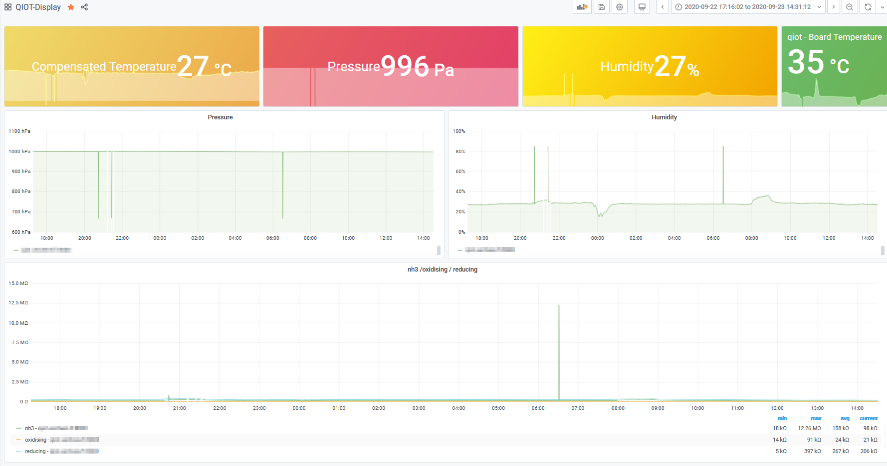

# Device metrics

* TOC
{:toc}

## Implementation

As we (Axians Cloud Builder), are comfortable building and installing observability solutions, and as we are not experienced developpers, we decided to quickly add prometheus metrics on the device sensor.

As prometheus metrics are kind of defacto standard, it would be easy to validate sensors values with such a tool.

On the python application, it's quite easy to implement, as a `prometheus_client` library exists, and you just need to define:

* all metrics you want to expose
* a `/metrics` route on your flask application

Then, every time the Edge Service will retrieve sensor metrics, they will be updated for prometheus server.

### Example

* Metrics definition

```python
PROM_WEATHER_METRICS = {
    "gauge" : {
        "temperature": Gauge('bme280_temperature_degrees', 'Temperature of the BME280 sensor'),
        "compensated_temperature": Gauge('bme280_compensated_temperature_degrees', 'Temperature of the BME280 sensor, compensated'),
        "pressure": Gauge('bme280_pressure_hpa', 'Pressure of the BME280 sensor'),
        "humidity": Gauge('bme280_humidity_percent', 'Humidity of the BME280 sensor')
    }
}
```

* Metrics set

```python
PROM_WEATHER_METRICS['gauge']['humidity'].set(d_jsonexport["humidity"])
```

* Metrics exposition

```python
@app.route('/metrics')
def metrics():
    """Flask endpoint to gather the metrics, will be called by Prometheus."""
    return Response(generate_latest(), mimetype=CONTENT_TYPE_LATEST)

```

* Result

```shell
# HELP bme280_temperature_degrees Temperature of the BME280 sensor
# TYPE bme280_temperature_degrees gauge
bme280_temperature_degrees 35.43881389387862
# HELP bme280_compensated_temperature_degrees Temperature of the BME280 sensor, compensated
# TYPE bme280_compensated_temperature_degrees gauge
bme280_compensated_temperature_degrees 25.536363043016017
# HELP bme280_pressure_hpa Pressure of the BME280 sensor
# TYPE bme280_pressure_hpa gauge
bme280_pressure_hpa 996.8632282248674
# HELP bme280_humidity_percent Humidity of the BME280 sensor
# TYPE bme280_humidity_percent gauge
bme280_humidity_percent 27.822407929844857
```

## Issues, Ideas

There is no issue to implement that. The drawback here is you need to expose your application, in order to be reachable from the outside world.

So, the future idea would be to expose the metrics internaly, and then create a dedicated prometheus server or shipper on the edge device (or anything like sidecar container that would scrape these metrics).

## Annexes

### Prometheus server Installation

* Just follow [linoxide prometheurs howto](https://linoxide.com/linux-how-to/install-prometheus-ubuntu/) to build a simple server.

### Configuration file

```cfg
  - job_name: 'qiot'
    scrape_interval: 60s
    static_configs:
      - targets: ['qio.lab.local:8000']
```

### Dashboard Example



## Ressources

* [prometheus: bien démarrer avec python](https://xincto.me/2018/05/prometheus-bien-demarrer-en-python.html)
* [linoxide prometheus howto](https://linoxide.com/linux-how-to/install-prometheus-ubuntu/)
