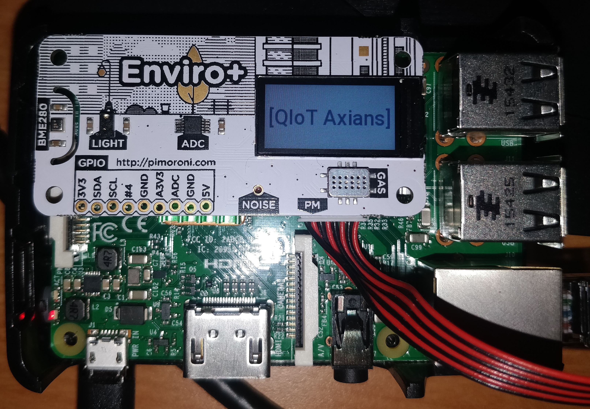

# QIoT Sensor

* TOC
{:toc}

## Implementation

## The coding side (not the dark side ;) )


The python application is composed of two main part :  
   + The retrievers : Metrics extended class  
   + The API exposer : Flask application with swagger explaination


### Retrievers

There are three retrievers :
   - gas_extend.py
   - weather_extend.py
   - particules_extend.py

Example with gas_extend.py :

```python
# gas_extend.py
from time import gmtime, strftime
from enviroplus import gas

#prom side
from prometheus_client import Gauge
from metrics import PROM_GAS_METRICS

def r_float_value_adc():
    if isinstance(gas.readall().adc, float):
        return gas.read_all().adc
    else:
        return 0


def r_float_value_nh3():
    if isinstance(gas.readall().nh3, float):
        PROM_GAS_METRICS['gauge']['nh3'].set(gas.read_all().nh3)
        return gas.read_all().nh3
    else:
        return 0


def r_float_value_oxidising():
    if isinstance(gas.readall().oxidising, float):
        PROM_GAS_METRICS['gauge']['oxidising'].set(gas.read_all().oxidising)
        return gas.read_all().oxidising
    else:
        return 0


def r_float_value_reducing():
    if isinstance(gas.readall().reducing, float):
        PROM_GAS_METRICS['gauge']['reducing'].set(gas.read_all().reducing)
        return gas.read_all().reducing
    else:
        return 0


def json_parsing_return():

    d_jsonexport={}
    d_jsonexport['instant']=strftime("%Y-%m-%d %H:%M:%S%Z", gmtime())
    d_jsonexport['nh3']=gas.read_all().nh3
    d_jsonexport['oxidising']=gas.read_all().oxidising
    d_jsonexport['reducing']=gas.read_all().reducing
    
    PROM_GAS_METRICS['gauge']['nh3'].set(d_jsonexport['nh3'])
    PROM_GAS_METRICS['gauge']['oxidising'].set(d_jsonexport['oxidising'])
    PROM_GAS_METRICS['gauge']['reducing'].set(d_jsonexport['reducing'])

    return d_jsonexport

```


Each of this have checking functions which enable to validate the type of values, and one which return the formatted values in json.

### API Exposer

the main

### Container image

To be compliant with the specifications, the container image is built based on the Fedora 31, with the following:
* Fedora base image, including all packages and python libraries to interract with the Raspberry Pi
* Fedora flask image, including python libraries and environment variables to launch flask application

The container is started with the following parameters:
* `-d` as daemon
* `--network=qiot` to be run in a specific dedicated network
* `-- privileged` to access to external devices such as GPIOs
* `-p 8000:8000` to expose external port 8000 (see [prometheus](prometheus.md), not used for production)
* `--name qiot-sensor` to define a tiny name

## Issues, Ideas

### Container Alpine

The current container is 970 MB, which is HUGE for a simple flask application. This is due mainly to:
* Fedora base image
* Python libraries and dependencies
* Unoptimised docker image build

We tried to build an alpine linux container, but the `numpy` python package is still compiling on aarch64 device...

### LCD

The Enviro+ board includes a LCD screen. We could use it to display usefull local information, inspired from [pimoroni examples](https://github.com/pimoroni/enviroplus-python/blob/master/examples/weather-and-light.py).

Instead, we prefer displaying useless information, and provides API endpoint, so if you want to post some text, on the board, you can:
```bash
curl -X POST -H 'Content-Type: application/json' -i 'http://127.0.0.1:8000/api/lcd' --data '{
"message": "Axians loves QIoT"
}'
```

Below the startup message:



## Annexes

### Build process

1. Checkout code
1. Build image 
1. Login to Quay.io
1. Push to Quay!

```
$ git clone https://github.com/ACB-FR/qiot-sensor-py
$ cd qiot-sensor-py
$ sudo podman build -t quay.io/acb-fr/qiot-sensor -t quay.io/acb-fr/qiot-sensor:1-aarch64 -t quay.io/acb-fr/qiot-sensor:1.0.3 .
$ sudo podman login
$ sudo podman push quay.io/acb-fr/qiot-sensor:1.0.3
```

Note: podman commands are run in sudo mode, as the container runs in privileged mode, and it's easier for that PoC to build and run container as root.

### Start Container

Once the container is built, run it!

```
$ sudo podman run -d --network=qiot --privileged -p 8000:8000 --name qiot-sensor quay.io/acb-fr/qiot-sensor:1.0.3
```

Make it restart automatically on boot with systemd:

1. Generate systemd file
1. Modify to comply with new linux tree `/run`
1. Copy and activate service

```
$ sudo podman generate systemd --name qiot-sensor > podman-qiot-sensor.service
$ vi podman-qiot-sensor.service
PIDFile=/run/containers/storage/overlay-containers/[...]/userdata/conmon.pid
$ sudo systemctl daemon-reload
$ sudo systemctl enable podman-qiot-sensor
$ sudo systemctl start podman-qiot-sensor.service
```

1. Check it runs!
```
$ sudo systemctl status podman-qiot-sensor.service
● podman-qiot-sensor.service - Podman container-qiot-sensor.service
   Loaded: loaded (/etc/systemd/system/podman-qiot-sensor.service; enabled; vendor preset: disabled)
   Active: active (running) since Tue 2020-09-22 19:24:41 UTC; 5min ago
     Docs: man:podman-generate-systemd(1)
 Main PID: 97930 (conmon)
    Tasks: 3 (limit: 997)
   Memory: 3.4M
      CPU: 1.940s
   CGroup: /system.slice/podman-qiot-sensor.service
           ├─97928 /usr/sbin/dnsmasq -u root --conf-file=/run/containers/cni/dnsname/qiot/dnsmasq.conf
           └─97930 /usr/bin/conmon --api-version 1 -s -c 8ffb54b96b1abf4b9d1144d5458a72dd20cd51c0b9b4f64134670d32d5cfad8d -u 8ffb54b96b1abf4b9d1144d5458a72dd20cd51c0b9b4f64134670d32d5cfad8d -r /usr/bin>

Sep 22 19:24:41 qiot.verchere.lab dnsmasq[97928]: using local addresses only for domain dns.podman
Sep 22 19:24:41 qiot.verchere.lab dnsmasq[97928]: reading /etc/resolv.conf
Sep 22 19:24:41 qiot.verchere.lab dnsmasq[97928]: using local addresses only for domain dns.podman
Sep 22 19:24:41 qiot.verchere.lab dnsmasq[97928]: using nameserver 192.168.1.10#53
Sep 22 19:24:41 qiot.verchere.lab dnsmasq[97928]: using nameserver 192.168.1.254#53
Sep 22 19:24:41 qiot.verchere.lab dnsmasq[97928]: read /run/containers/cni/dnsname/qiot/addnhosts - 1 addresses
Sep 22 19:24:41 qiot.verchere.lab podman[97782]: 2020-09-22 19:24:41.29127181 +0000 UTC m=+1.755286386 container init 8ffb54b96b1abf4b9d1144d5458a72dd20cd51c0b9b4f64134670d32d5cfad8d (image=quay.io/acb>
Sep 22 19:24:41 qiot.verchere.lab podman[97782]: 2020-09-22 19:24:41.336614494 +0000 UTC m=+1.800629071 container start 8ffb54b96b1abf4b9d1144d5458a72dd20cd51c0b9b4f64134670d32d5cfad8d (image=quay.io/a>
Sep 22 19:24:41 qiot.verchere.lab podman[97782]: qiot-sensor
Sep 22 19:24:41 qiot.verchere.lab systemd[1]: Started Podman container-qiot-sensor.service.
```
